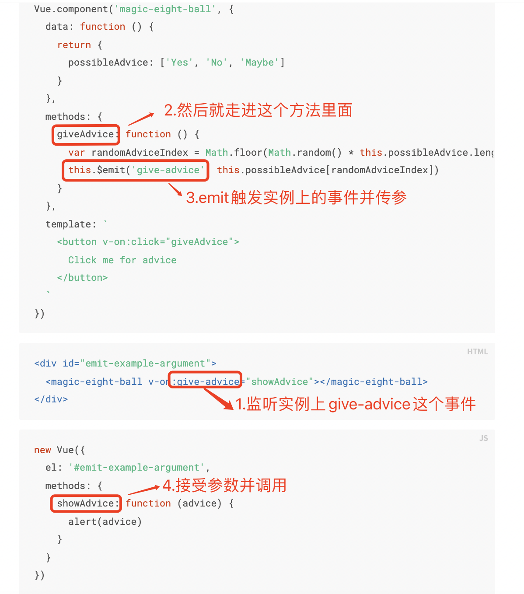

## 组件传值
父级组件可以像处理原生 DOM 事件一样通过 v-on 或 @ 监听子组件实例的任意事件
子组件可以通过调用内建的 $emit 方法并传入事件名称来触发一个事件


## 模板中可以出现的全局变量
```js
'Infinity,undefined,NaN,isFinite,isNaN,parseFloat,parseInt,decodeURI,' +
  'decodeURIComponent,encodeURI,encodeURIComponent,Math,Number,Date,Array,' +
  'Object,Boolean,String,RegExp,Map,Set,JSON,Intl,BigInt'
```

## 计算属性 vs 函数 vs watch
计算属性：模板中多次包含此计算，需要使用计算属性，可以像普通属性一样将数据绑定到模板中的计算属性（默认getter函数）

函数：没有缓存，每当触发重新渲染时，调用方法将始终会再次执行函数

watch：提供了一个更通用的方法来响应数据的变化，当需要在数据变化时执行异步或开销较大的操作时，这个方式是最有用的

计算属性和data中的属性将基于它们的响应依赖关系缓存，只会在相关响应式依赖发生改变时重新求值。这就意味着只要依赖的data中属性值还没有发生改变，多次访问计算属性会立即返回之前的计算结果，而不必再次执行

Vue 提供了一种更通用的方式来观察和响应当前活动的实例上的数据变动：侦听属性。当你有一些数据需要随着其它数据变动而变动时，watch 很容易被滥用。然而，通常更好的做法是使用计算属性而不是命令式的 watch 回调。

## class绑定 && style绑定
对象语法
```html
<div :class="{ active: isActive,'text-danger': hasError }"></div>
```
数组语法
```html
<div :class="[activeClass, errorClass]"></div>
<!-- 下面两种写法👇等价 -->
<div :class="[isActive ? activeClass : '', errorClass]"></div>
<div :class="[{ active: isActive }, errorClass]"></div>
```
组件上使用
```html
<div id="app">
  <my-component class="baz"></my-component>
</div>
```
```js
const app = Vue.createApp({})

app.component('my-component', {
  template: `
    <p :class="$attrs.class">Hi!</p>      
    <span>This is a child component</span>
  `
  //组件有多个根元素，用$attrs.class自定义哪个根元素接收class属性
})
```
class与style大部分同
:::tip
当在组件中使用时，自定义指令总是会被应用在组件的根节点上,和 attribute 不同，指令不会通过 v-bind="$attrs" 被传入另一个元素。组件可能会有多个根节点,当被应用在一个多根节点的组件上时，指令会被忽略，并且会抛出一个警告。
:::

## vue指令
> 指令缩写：
>- v-on @
>- v-bind ：
>- v-slot #
:::tip
v-for 与 v-if,当它们处于同一节点，v-if 的优先级比 v-for 更高，这意味着 v-if 将没有权限访问 v-for 里的变量
:::

:::tip
有时也需要在内联语句处理器中访问原始的 DOM 事件,可以用特殊变量 $event 把它传入方法
```html
<button @click="warn('Form cannot be submitted yet.', $event)">
  Submit
</button>
```
:::

## 插槽
`<slot> `作为我们想要插入内容的占位符
> 父级模板里的所有内容都是在父级作用域中编译的；子模板里的所有内容都是在子作用域中编译的
>- 备用内容和具名插槽
```html
<!-- 父组件 -->
<submit-button>
  <template v-slot:slotname>
    <div>传入子组件对应name的插槽位置中的内容</div>
  </template>
</submit-button> 
<!-- 子组件 -->
<button>
  <slot>备用内容，如果父组件不提供内容，这里将展示</slot>
  <slot name="slotname"></slot>
</button>
```
>- 作用域插槽，父组件使用子组件时，插槽能访问子组件中才有的数据
```html
<!-- 父组件 -->
<todo-list>
  <template v-slot:default="slotProps">
    <span>{{ slotProps.item }}</span>
  </template>
</todo-list>
<!-- 子组件 -->
<ul>
  <li v-for="( item, index ) in items">
    <slot :item="item" :index="index"></slot>
  </li>
</ul>
```
>- 解构插槽prop
`slotProps`值实际上可以是任何能够作为函数定义中的参数的 JavaScript 表达式,可以使用解构传入具体插槽prop
```html
<todo-list v-slot="{ item }">
  <span>{{ item }}</span>
</todo-list>
```
将 item 重命名为 todo`v-slot="{ item: todo }"`

定义备用内容，以防插槽 prop 是 undefined `v-slot="{ item = 'Placeholder' }"`

动态插槽名 `v-slot:[dynamicSlotName]`

## API
defineAsyncComponent

## 渲染函数
#### javascript代替模版功能
>- v-model
```js
props: ['modelValue'],
emits: ['update:modelValue'],
render() {
  return h(SomeComponent, {
    modelValue: this.modelValue,
    'onUpdate:modelValue': value => this.$emit('update:modelValue', value)
  })
}
```
>- 插槽

#### 工厂函数实现重复子VNodes
下面这渲染函数用完全合法的方式渲染了 20 个相同的段落：
```js
render() {
  return h('div',
    Array.from({ length: 20 }).map(() => {
      return h('p', 'hi')
    })
  )
}
```